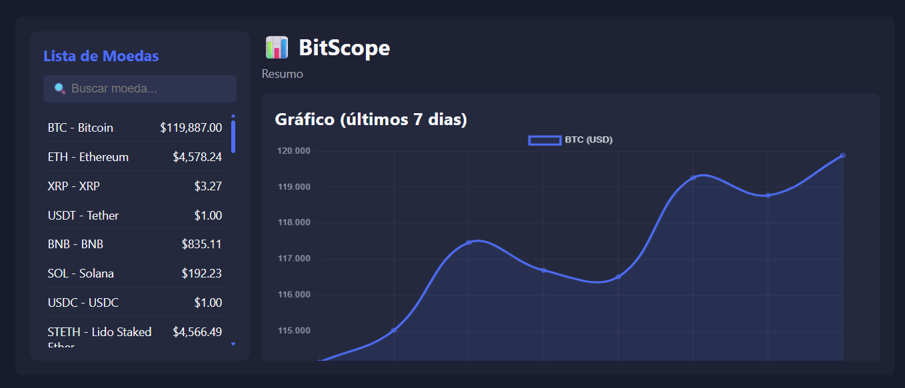

# 📈 BitScope - Cryptocurrency

## 📝 Description

BitScope is a clean dashboard built to practice working with APIs.

## ✨ Features

-  Searchable list of top 50 cryptocurrencies by market cap  
-  Current price displayed in USD, formatted neatly  
-  Line chart showing 7-day price history of the selected coin  
-  Interactive selection updates the chart instantly

## 🛠️ Technologies

- HTML, CSS, JavaScript  
- Chart.js for chart rendering  
- Public CoinGecko API 
